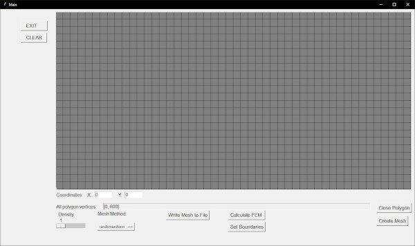

# FEM
## Description
Simple FEM calculation with implemented GUI, mesh creation, solver and output
- !WIP! Many features not yet implemented, placeholder variables, etc.

## Quick Start

- run gui.py
- Click on canvas to create polygon (starting node is 0,0 -> bottom left corner)
- Close Polygon closes Polygon (last bode connects to node point)
- Select Density -> 1 low density, 10 high density
- Create Mesh
- Set Boundaries -> Select Boundary, enter Value -> Set Value
- Calculate FEM

## Dependencies
- Numpy
- MatPlotLib
- SciPy
  
## To be added
- ...
